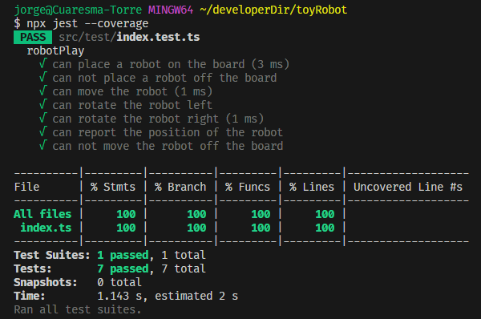

# TOYROBOT

## Set-up 

Para poder ejecutar este proyecto es necesario tener instalado Node >= 18

Instalamos las dependencias ejecutando:
```
npm install
```
Este proyecto tiene un set de tests que se ejecuta utilizando Jest para ello utilizamos el comando:
```
npm run test
```
Para ver el coverage de estos tests utilizamos el comando:
```
npx jest --coverage
```
